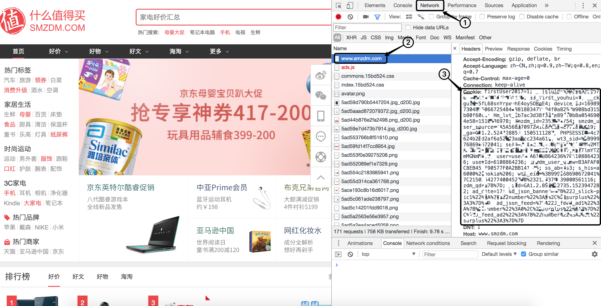
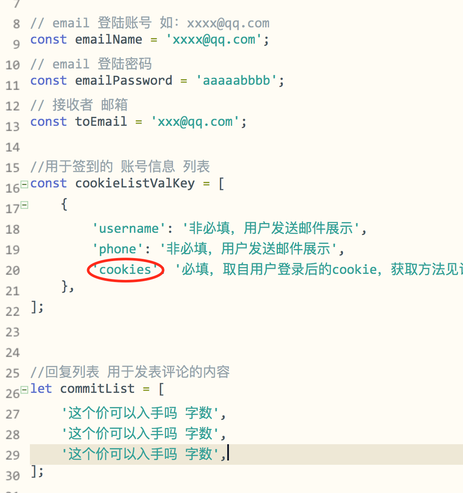
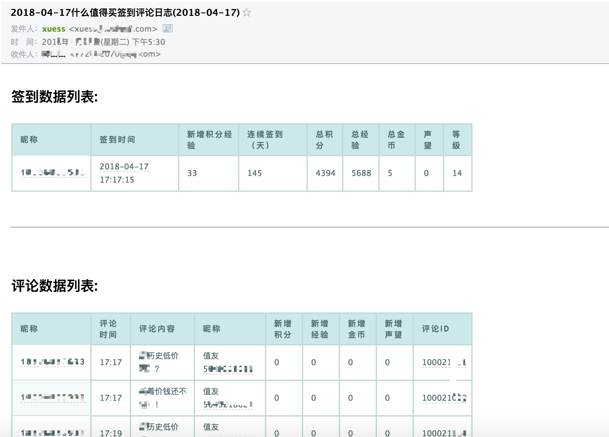

>本项目是基于`nodejs`开发，实现的功能是，`什么值得买`自动签到，自动评论功能，自动发邮件，支持多人多账号运行
>
>目的是为了，解放双手，轻松获取`什么值得买`的`经验`和`积分`，得到更高的`等级`，从而突破很会员等级限制，如领取部分紧俏的优惠券
>
>项目运行即执行`签到`和`评论`
>
>目前规则：每天`6:10` 执行签到和评论功能，`17:30`执行`签到结果`邮件发送功能，执行间隔为随机时间，可自行修改。
>
>由于值得买，每天前三条，发送评论有`经验`和`积分`，故该项目每天会随机发送`3`条评论，评论内容请到`config.js`文件中配置
>
>
>如有条件，请执行在`vps`、`树莓派`上
>
>本项目gitbub地址: [https://github.com/xuess/smzdm-sign](https://github.com/xuess/smzdm-sign)
>
>喜欢请`star`，有不明白的地方，欢迎提问
>


## 项目的配置与运行

需要准备

* qq邮箱，账号和密码，用于发送邮件
* 什么值得买的账号`cookie`
* 可以执行`nodejs`的运行环境
* (不必须)可24小时开机的运行环境


### 获取什么值得买`cookie`方法

* 1.首先 使用`chrome浏览器`，访问 `什么值得买pc端`， 登陆 `什么值得买` 账号
* 2.打开`开发者工具`, `win`系统 快捷键 `F12` ，`mac` 快捷键 `option + command + i`
* 3.打开`开发者工具` 中的 `Network`选项卡，**刷新页面** ,然后选第一个 `www.smzdm.com`,然后找到右侧的 `Cookie`字段，复制出来。 


如图操作：




### 填写cookie信息

打开项目文件 `config.js` ，找到`cookie`

> 如配置多个账号，请复制多个个


```javascript
	{
		'username': '非必填，用户发送邮件展示',
		'phone': '非必填，用户发送邮件展示',
		'cookies': '必填，取自用户登录后的cookie，获取方法见说明文档'
	},

```


> 别忘记填**邮箱信息**和**评论列表**


如图：



### 运行 

```bash
# 先安装依赖 文件
npm i

#执行脚本
node smzdm.js

#或
npm run dev

#后台运行执行脚本
nohup node smzdm.js &

#或
nohup npm run dev &

```

### 如果需要长时间运行 请用`pm2进程管理工具`

```bash
#全局安装pm2
npm i pm2 -g 

#启动签到进程
pm2 start smzdm.js

#显示所有进程状态
pm2 list 

#监视所有进程
pm2 monit              

#显示所有进程日志
pm2 logs

```

> 关于`pm2`的详细使用介绍请看  --> [https://www.xueshanshan.top/post/node-npm-pm2.html](https://www.xueshanshan.top/post/node-npm-pm2.html)


### 定时邮件 发送效果

 


